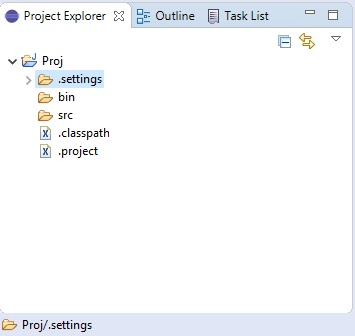
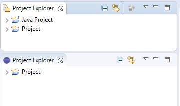
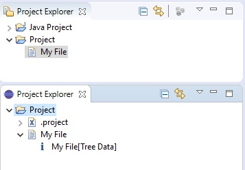
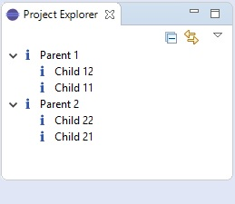
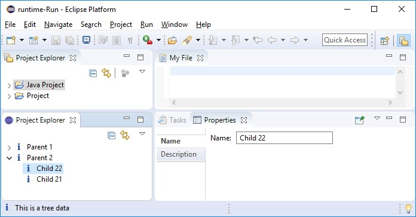

[ [English](README.md) ] | [ На руском ]

# Eclipse Plugins (UI-Extensions)

В этом репозитории я собираю исходники для Plug-in Project Eclipse, демонстрирующие создание/настройку различных UI-расширений для Eclipse. Материал рассчитан главным образом для начинающих. 

Eclipse EE Version: 2018-09 (4.9.0) Java 1.8.0_191

1. [View](#1-View)
2. [Property Page](#2-Property-Page)
3. [Common Navigator](#3-Common-Navigator)

## 1. [View](https://github.com/firstevilbit/EclipsePlugins-UI-Extensions/tree/master/ProjectTabs/src/org/evilbit/simpleview)
Это пример самой наипростейшей реализации расширение org.eclipse.ui.views. Для того чтобы открыть View нажмите *Window > Show View > Other... > Category Simple View > Simple View*

В plugins.xml есть \<extension point="org.eclipse.ui.views"\>, которая содержит настройки для view. В поле class указана реализация этой view. Она находится в пакете org.evilbit.simpleview, это элементарный класс **SimpleViewClass** расширяющий ViewPart.

Результат:

 

## 2. [Property Page](https://github.com/firstevilbit/EclipsePlugins-UI-Extensions/tree/master/ProjectTabs/src/org/evilbit/propertypage)
Пример реализации расширения org.eclipse.ui.propertyPages. **Property Pages** можно открыть следующим способом: в **ProjectExplorer**, например на проекте, вызываем контекстное меню, выбираем самый нижний пункт меню **Properties** и там мы увидим наш **Sample PropertyPage**.

В plugins.xml есть \<extension point="org.eclipse.ui.propertyPages"\>, которая содержит настройки для page. В поле class указана реализация для propertyPages, она находится в пакете org.evilbit.propertypage.

Результат:

 

## 3. Common Navigator

#### 1. [Создаём Common navigator](https://github.com/firstevilbit/EclipsePlugins-UI-Extensions/tree/master/ProjectTabs/src/org/evilbit/navigator/views)
Пример реализации **Navigator View** через расширение org.eclipse.ui.views и org.eclipse.ui.navigator.viewer. Для того чтобы открыть View нажмите *Window > Show View > Other... > Category custom plugin views > Project Explorer*

Все настройки по отображению контента находятся в plugins.xml. Отображение контента происходит через View с Id = "org.evilbit.navigator.views.ProjectExplorerId". Настройки по отображению контента находятся в расширении \<extension point="org.eclipse.ui.navigator.viewer"\>. 

Первоисточник: http://codexe.net/eclipse/create-a-common-navigator.html

Результат:

#### 2. [Добавляем фильтр в Common navigator](https://github.com/firstevilbit/EclipsePlugins-UI-Extensions/tree/master/ProjectTabs/src/org/evilbit/navigator/filters)
Дбавляем расширение org.eclipse.ui.navigator.navigatorContent. Указываем класс NavigatorFilter расширяющий **org.eclipse.jface.viewers.ViewerFilter**. Настроем фильтрацию в классе NavigatorFilter, скроем отображение Java-проектов.

Первоисточник: http://codexe.net/eclipse/add-filter-to-common-navigator.html

Результат:

#### 3. [Добавление своего контента в Common navigator](https://github.com/firstevilbit/EclipsePlugins-UI-Extensions/tree/master/ProjectTabs/src/org/evilbit/navigator/views/navigator)
Сделаем некоторые настройки в org.eclipse.ui.navigator.viewer и org.eclipse.ui.navigator.navigatorContent. Суть настроек заключается в следующем: Common navigator будет отображать ресурсные объекты (то что у нас уже отображается) и наш собственный тип PropertiesTreeData. NavigatorContentProvider будет создавать наши узлы типа PropertiesTreeData, а NavigatorLabelProvider иконки и лейблы.

Первоисточник: http://codexe.net/eclipse/add-contents-to-common-navigator.html

Результат:

#### 4. [Отображение пользовательских данных в Common navigator](https://github.com/firstevilbit/EclipsePlugins-UI-Extensions/tree/master/ProjectTabs/src/org/evilbit/navigator/views/navigator/data)
Создадим собственную структуру данных, дочерний узел будет описан в классе PropertiesTreeData, а родительский в классе PropertiesTreeParentData расширенный от PropertiesTreeData. Структура данных создаст класс PropertiesTreeRootData. 
Также необходимо внести небольшие изменения в уже существующие классы, такие как: NavigatorContentProvider, NavigatorLabelProvider и NavigatorFilter. 

Первоисточник: http://codexe.net/eclipse/show-custom-data-on-navigator.html

Результат:

#### 5. [Добавляем меню в Common navigator](https://github.com/firstevilbit/EclipsePlugins-UI-Extensions/tree/master/ProjectTabs/src/org/evilbit/navigator/views/navigator)
В классе NavigatorActionProvider происходит инициалазация контекстного меню, а в классе AddNodeAction определяем условия активности пункта меню и действия, которое будет выполнятся.

Первоисточник: http://codexe.net/eclipse/add-menu-to-common-navigator.html

Результат:

#### 6. [Добавляем сортировку в Common navigator](https://github.com/firstevilbit/EclipsePlugins-UI-Extensions/tree/master/ProjectTabs/src/org/evilbit/navigator/views/navigator/data)
Сортировка реализована в классе NavigatorSorter в переопределённом методе compare. Метод будет извлекать номера из имён узлов и сортировать их в обратном порядке. Сортировка произойдёт автоматически сразу после получения дочерних элементов методом getChildren(Object parentElement).

Первоисточник: http://codexe.net/eclipse/add-sorter-to-common-navigator.html

Результат:

## 4. [Tabbed Properties](https://github.com/firstevilbit/EclipsePlugins-UI-Extensions/tree/master/ProjectTabs/src/org/evilbit/navigator/views/navigator/data)

Первоисточник: http://codexe.net/eclipse/create-tabbed-property-view.html

Результат:

