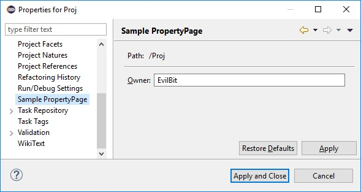

# Eclipse Plugins (UI-Extensions)

В этом репозитории я собираю исходники для Plug-in Project Eclipse, демонстрирующие создание/настройку различных UI-расширений для Eclipse. Материал рассчитан главным образом для начинающих. 

1. [View](#1-View)
2. [Property Page](#2-Property-Page)
3. [Common Navigator](#3-Common-Navigator)

## 1. [View](https://github.com/firstevilbit/EclipsePlugins-UI-Extensions/tree/master/ProjectTabs/src/org/evilbit/simpleview)
Это пример самой наипростейшей реализации расширение org.eclipse.ui.views. Для того чтобы открыть View нажмите *Window > Show View > Other... > Category Simple View > Simple View*

В plugins.xml есть \<extension point="org.eclipse.ui.views"\>, которая содержит настройки для view. В поле class указана реализация этой view. Она находится в пакете org.evilbit.simpleview, это элементарный класс **SimpleViewClass** расширяющий ViewPart.

Результат:

 

## 2. [Property Page](https://github.com/firstevilbit/EclipsePlugins-UI-Extensions/tree/master/ProjectTabs/src/org/evilbit/propertypage)
Пример реализации расширения org.eclipse.ui.propertyPages. **Property Pages** можно открыть следующим способом: в **ProjectExplorer**, например на проекте, вызываем контекстное меню, выбираем самый нижний пункт меню **Properties** и там мы увидим наш **Sample PropertyPage**.

В plugins.xml есть \<extension point="org.eclipse.ui.propertyPages"\>, которая содержит настройки для page. В поле class указана реализация для propertyPages, она находится в пакете org.evilbit.propertypage.

Результат:

 

## 3. Common Navigator

#### 1. [Создаём Common navigator](https://github.com/firstevilbit/EclipsePlugins-UI-Extensions/tree/master/ProjectTabs/src/org/evilbit/navigator/views)
Пример реализации **Navigator View** через расширение org.eclipse.ui.views и org.eclipse.ui.navigator.viewer. Для того чтобы открыть View нажмите *Window > Show View > Other... > Category custom plugin views > Project Explorer*

Все настройки по отображению контента находятся в plugins.xml. Отображение контента происходит через View с Id = "org.evilbit.navigator.views.ProjectExplorerId". Настройки по отображению контента находятся в расширении \<extension point="org.eclipse.ui.navigator.viewer"\>. 

Первоисточник: http://codexe.net/eclipse/create-a-common-navigator.html

Результат:

